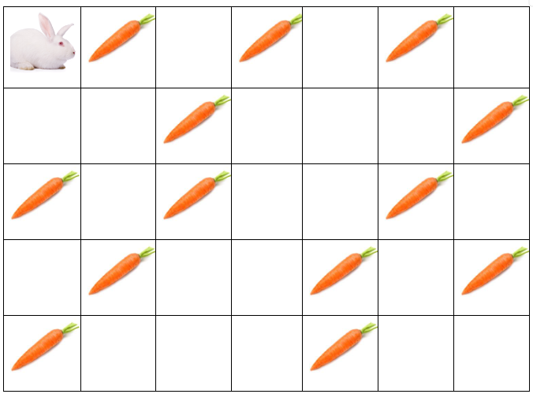

# LE LAPIN ET LES CARROTES

**FallDiagne** surnommé le lapin adorable aime trop les carrotes.
Mais malheuresement il est trés limité dans ses déplacements. il ne peut aller que **_vers le bas ou vers la droite_**. En supposant qu'il se trouve dans un espace ouvert qu'on peut modéliser comme un tableau de 2 dimensions (matrice).
Sur chaque cellule du tableau il y a soite la présence d'une carrote ou non. L'idée est d'aider notre mignon lapin a manger le maximum de carrotes possible entre un point S donné son point de depart et un point E le point d'arrivé. Tout en respectant les contraintes de déplacement de **FallDiagne**.

> [!NOTE]
> La [parenté à plaisanteries](https://www.cairn.info/revue-raisons-politiques-2004-1-page-157.htm) est une relation entre deux personnes dans laquelle l’une est autorisée par la coutume, et dans certains cas, obligée, de taquiner l’autre ou de s’en moquer; l’autre, de son côté, ne doit pas en prendre ombrage. Ce fut le cas entre les noms de famille **Diagne, Fall, Mbengue, Dieng**,... et le mien **NIANG**.
